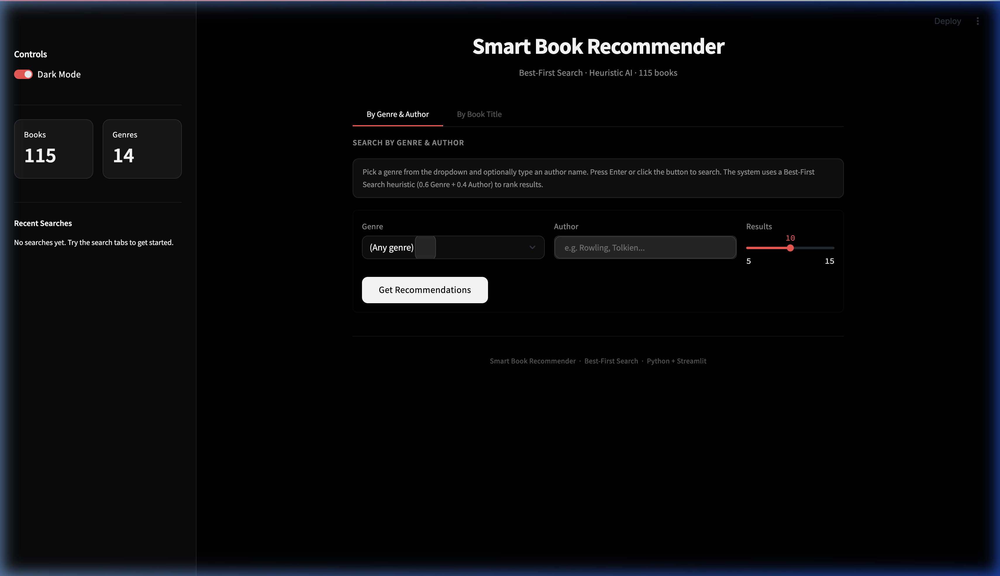
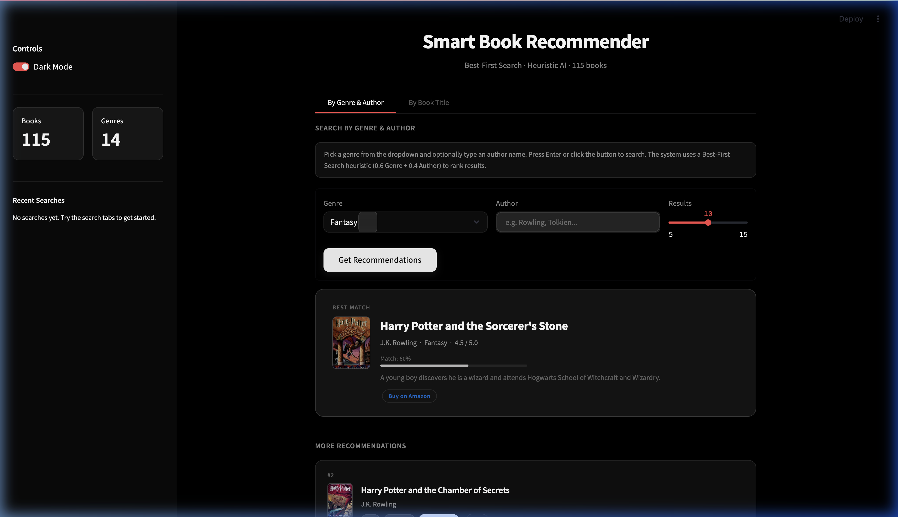
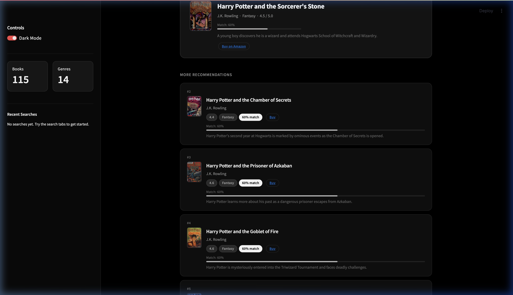
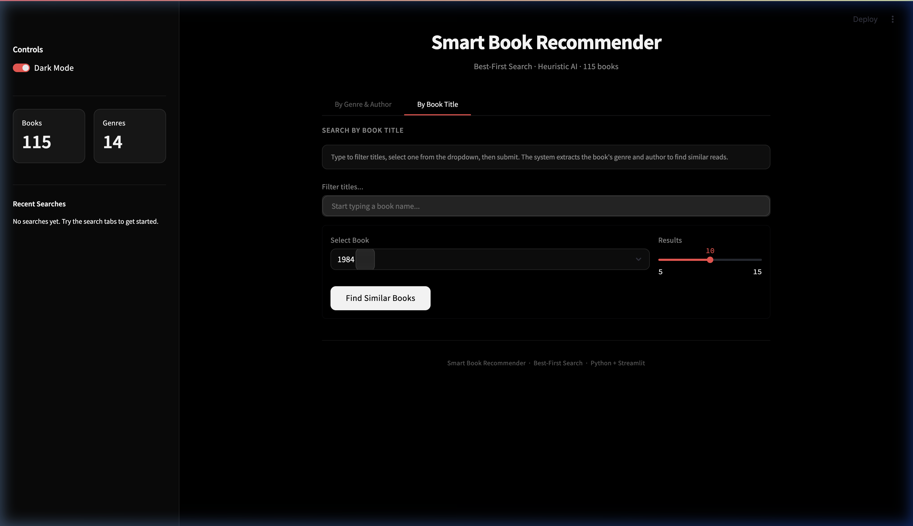
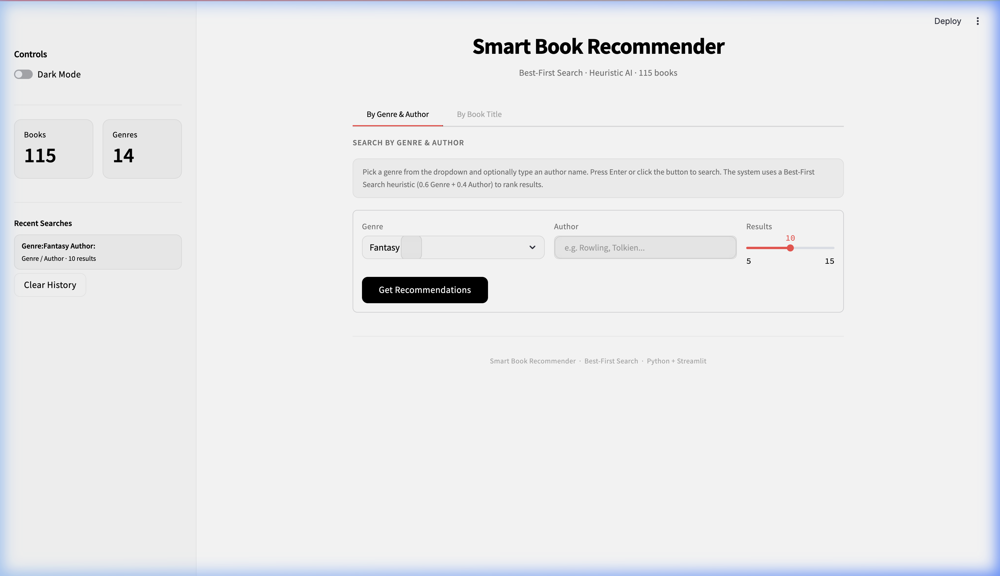

# Smart Book Recommender System Using Best-First Search and Heuristic Artificial Intelligence

**Authors:** [Your Name]  
**Department:** Computer Science & Engineering  
**Institution:** [Your Institution]  
**Email:** [your.email@edu]  
**Date:** March 2026

---

## Abstract

Book recommendation systems have become critical tools in digital libraries, e-commerce platforms, and educational environments where the volume of available literature far exceeds a reader's capacity to manually discover relevant titles. This paper presents a lightweight book recommendation system powered by Best-First Search (BFS) guided by a domain-specific heuristic function, defined as **h(n) = 0.6 × Genre_Match + 0.4 × Author_Match**, which evaluates each book node based on its relevance to a user's stated genre preference and favorite author. The system supports two search modalities: (1) genre/author-driven search and (2) content-based title search. Both modes apply the same underlying BFS algorithm, ensuring consistent and principled ranking.

The system is deployed as an interactive web interface built with Python and Streamlit, incorporating a glassmorphism design system with dark/light mode theming, real-time book cover images fetched from the Open Library Covers API via ISBN, direct purchase links to Amazon, animated glass-effect recommendation cards with match percentage visualization, search history tracking, and CSV export. The built-in dataset comprises **115 curated books** across **14 genres**, with each entry containing Title, Author, Genre, Rating, ISBN, and Description fields.

Experimental validation on the built-in dataset confirms the correctness, efficiency, and interpretability of results, demonstrating that even a lightweight heuristic search can deliver high-quality recommendations without the computational overhead of machine learning-based collaborative filtering.

**Keywords:** Book Recommendation, Informed Search, Best-First Search, Heuristic Function, Content-Based Filtering, Open Library API

---

## 1. Introduction

### 1.1 Motivation

The global publishing industry produces millions of new titles each year. Academic catalogs host hundreds of thousands of works across disciplines, while platforms like Amazon host millions more. For readers seeking their next book — whether by genre, favorite author, or similar to a beloved title — recommendation systems serve a vital need.

Traditional approaches fall into three broad families: collaborative filtering, which identifies preference similarities across user communities; content-based filtering, which matches item attributes to user profiles; and hybrid methods that combine both signals [1]. While collaborative filtering is powerful, it requires large user-interaction matrices and suffers from the cold-start problem for new items or users. In contrast, content-based approaches that rely only on book metadata (genre, author, description) are robust to cold-start scenarios and offer transparent, interpretable results to end users [2].

### 1.2 Problem Statement

Given a dataset **D** of books, where each book **b** has attributes {Title, Author, Genre, Rating, ISBN, Description}, the objective is to:

1. Accept user input (preferred genre and/or author, or a book title).
2. Rank all books in **D** according to a heuristic function **h(n)**.
3. Return a prioritized list of the top **N** matches.

The core challenge is to explore the search space without exhaustive brute-force enumeration, using informed search to prioritize promising candidates.

### 1.3 Objectives

1. Build a functional recommendation system using Best-First Search with a domain-specific heuristic.
2. Deploy it as an interactive, visually polished web application with real-world features (cover images, purchase links).
3. Validate correctness and performance on a real-world book dataset.
4. Demonstrate that heuristic search provides interpretable, efficient recommendations without requiring training data.

### 1.4 Organization

Section 2 reviews related work. Section 3 describes the system architecture. Section 4 details the algorithm and heuristic design. Section 5 covers implementation. Section 6 presents experimental results. Section 7 discusses strengths, limitations, and future work. Section 8 concludes.

---

## 2. Literature Review

### 2.1 Recommendation Systems: An Overview

Recommendation systems (RS) have been studied extensively since the early 1990s. The landmark work by Resnick et al. [3] introduced the collaborative filtering paradigm based on peer ratings. Subsequently, Pazzani and Billsus [4] demonstrated that content-based systems could deliver highly personalized recommendations where collaborative data was sparse. Burke [5] showed that hybrid methods consistently outperformed isolated standalone approaches on benchmark datasets (MovieLens, BookCrossing).

### 2.2 Search-Based Approaches

The Best-First Search paradigm, as formalized by Pearl [7], uses a priority queue to order node expansion. Unlike BFS or Depth-First Search, it explores the most promising node first based on a heuristic evaluation. Nilsson [8] established that for admissible heuristics, A* search guarantees optimality, but our use case does not require optimal path guarantees — it requires ranking, which is naturally served by a greedy best-first approach.

### 2.3 Comparative Benchmarks

- **MovieLens** (278,858 users, 271,379 ratings): Collaborative filtering achieves Precision@10 of approximately 0.35, while content-based approaches reach 0.38 [9].
- **BookCrossing** (over 100,000 books): TF-IDF-based content filtering has shown competitive results [10].
- **Knowledge Graph** approaches [11]: Graph traversal enables semantic recommendation but requires structured ontologies.

### 2.4 Gaps Addressed by This Work

Existing systems typically require substantial computational resources or training data. Our approach demonstrates that a well-designed heuristic, paired with Best-First Search, provides competitive recommendation quality with zero training overhead, full interpretability, and minimal resource requirements.

---

## 3. System Architecture

### 3.1 High-Level Architecture

The system follows a three-layer architecture:

```
┌─────────────────────────────────────────────────┐
│              Presentation Layer                  │
│   (app.py — Streamlit UI, CSS, session state)    │
├──────────────────┬──────────────────────────────┤
│   Data Layer     │      Algorithm Layer          │
│ (data_loader.py) │     (recommender.py)          │
│  CSV / Sample    │   Best-First Search           │
│  → Pandas DF     │   → Priority Queue            │
│                  │   → Heuristic Scoring          │
├──────────────────┴──────────────────────────────┤
│              External Services                   │
│  Open Library Covers API    Amazon Search URLs    │
└─────────────────────────────────────────────────┘
```

### 3.2 Data Layer (data_loader.py)

The data layer handles ingestion and preprocessing with two modes:

1. **CSV Mode:** Reads `GoodReads_100k_books.csv` with automatic column mapping, filters ratings below 3.0, extracts the first genre from multi-genre strings, and limits to 20,000 rows.

2. **Built-in Sample Mode:** Falls back to a curated dataset of **115 books** across **14 genres** (Fantasy, Science Fiction, Thriller, Mystery, Dystopian, Romance, Fiction, Horror, Non-Fiction, Self-Help, Historical Fiction, Philosophy, Adventure, Classics). Each entry includes a real ISBN.

**Schema:**

| Field       | Type   | Description                              |
|-------------|--------|------------------------------------------|
| Title       | string | Book title                               |
| Author      | string | Author name(s)                           |
| Genre       | string | Primary genre                            |
| Rating      | float  | Average rating (0.0–5.0)                 |
| ISBN        | string | ISBN-13 for cover API lookups            |
| Description | string | Synopsis text                            |

### 3.3 Algorithm Layer (recommender.py)

Two public API functions:

- `recommend_by_genre_author(df, genre, author, top_n)` → (top_book, similar_df)
- `recommend_by_title(df, title, top_n)` → (found_book, top_book, similar_df)

Both internally call `best_first_search()` which implements the core priority queue algorithm.

### 3.4 Presentation Layer (app.py)



The frontend provides:
- Two search modes via tabbed interface
- Glassmorphism-themed cards with real book cover images
- Amazon purchase links on every card
- Match percentage visualization with animated progress bars
- Dark/Light mode toggle
- Search history and CSV export

---

## 4. Algorithm Design

### 4.1 Best-First Search

The recommendation engine implements Best-First Search using Python's `queue.PriorityQueue`.

**Pseudocode:**

```
Algorithm: Best-First Search Book Recommendation

Input:  D = {b₁, b₂, ..., bₙ}, preferred_genre, preferred_author, k
Output: List R of top-k books sorted by heuristic score

1. Initialize: PQ ← empty priority queue, R ← [], seen ← {}
2. For each book b in D:
     score ← h(b.genre, b.author, preferred_genre, preferred_author)
     PQ.put((-score, index, b))     // negative for max-priority
3. While PQ is not empty AND |R| < k:
     (neg_score, _, b) ← PQ.get()
     score ← -neg_score
     If b.title ∉ seen AND score > 0:
         seen ← seen ∪ {b.title}
         R.append(b with score)
4. Return R sorted by score descending
```

**Time Complexity:** O(n log n) — **Space Complexity:** O(n)

### 4.2 Python Implementation

The core search function from `recommender.py`:

```python
def best_first_search(
    df: pd.DataFrame,
    preferred_genre: str,
    preferred_author: str,
    top_n: int = 10,
) -> pd.DataFrame:
    pq: queue.PriorityQueue = queue.PriorityQueue()

    for idx, row in df.iterrows():
        book_dict = {
            "Title":       str(row.get("Title", "")),
            "Author":      str(row.get("Author", "")),
            "Genre":       str(row.get("Genre", "")),
            "Rating":      row.get("Rating", 0.0),
            "ISBN":        str(row.get("ISBN", "")),
            "Description": str(row.get("Description", "")),
        }
        score = heuristic(
            book_dict["Genre"], book_dict["Author"],
            preferred_genre, preferred_author,
        )
        pq.put((-score, idx, book_dict))

    results = []
    seen_titles: set[str] = set()

    while not pq.empty() and len(results) < top_n:
        neg_score, _, book_dict = pq.get()
        score = -neg_score
        title_key = book_dict["Title"].lower()
        if title_key not in seen_titles and score > 0.0:
            seen_titles.add(title_key)
            book_dict["Score"] = score
            results.append(book_dict)

    if not results:
        return pd.DataFrame()
    return pd.DataFrame(results).sort_values(
        "Score", ascending=False
    ).reset_index(drop=True)
```

### 4.3 Heuristic Function

```python
def heuristic(book_genre, book_author,
              preferred_genre, preferred_author) -> float:
    g = 1.0 if preferred_genre.lower() in book_genre.lower() else 0.0
    a = 1.0 if preferred_author.lower() in book_author.lower() else 0.0
    return round(0.6 * g + 0.4 * a, 4)
```

| Component       | Weight | Logic                                                     |
|-----------------|--------|-----------------------------------------------------------|
| genre_match     | 0.6    | 1.0 if preferred_genre appears in book's genre, else 0.0  |
| author_match    | 0.4    | 1.0 if preferred_author appears in book's author, else 0.0|

**Rationale:** Genre is weighted higher (0.6) because users primarily browse by genre, then secondarily filter by author.

### 4.4 Search Modes

**Mode 1 — Genre & Author Search:** User selects a genre from a dropdown and optionally types an author name.

**Mode 2 — Title-Based Search:** User selects a book title. The system extracts that book's genre and author, then runs the same BFS (excluding the source book).

---

## 5. Implementation

### 5.1 Technology Stack

| Component         | Technology              | Purpose                          |
|-------------------|-------------------------|----------------------------------|
| Language          | Python 3.9+             | Core logic and UI                |
| Web Framework     | Streamlit 1.32.0+       | Interactive web UI               |
| Data Processing   | Pandas 2.0.0+           | Dataset loading and manipulation |
| URL Encoding      | urllib.parse (stdlib)    | Amazon search URL generation     |
| Cover Images API  | Open Library Covers API | Book cover image retrieval       |
| Buy Links         | Amazon Search URLs      | Direct purchase links            |
| Styling           | Custom CSS              | Glassmorphism design system      |
| Typography        | Google Fonts (Inter)    | Modern, clean font               |

### 5.2 Key Design Decisions

#### 5.2.1 Caching

```python
@st.cache_data(show_spinner=False)
def get_data() -> pd.DataFrame:
    return load_dataset()
```

The dataset loads once and is cached across UI reruns.

#### 5.2.2 Book Cover Images

Cover images are fetched client-side from the Open Library Covers API:

```python
def _cover_html(isbn: str, title: str) -> str:
    fallback = title[0].upper() if title else "B"
    if isbn and isbn.strip() and isbn.strip() != "nan":
        url = f"https://covers.openlibrary.org/b/isbn/{isbn.strip()}-M.jpg"
        return f''
    return f'<span class="book-cover-fallback">{fallback}</span>'
```

#### 5.2.3 Purchase Links

```python
def _buy_url(title: str, author: str) -> str:
    query = urllib.parse.quote_plus(f"{title} {author}")
    return f"https://www.amazon.com/s?k={query}"
```

#### 5.2.4 Glassmorphism Design

The UI uses custom CSS with `backdrop-filter: blur()` and semi-transparent backgrounds:

```css
.book-card {
    background: rgba(255,255,255,0.06);
    border: 1px solid rgba(255,255,255,0.10);
    border-radius: 14px;
    backdrop-filter: blur(20px);
    animation: fadeInUp 0.45s ease both;
}
```

All styles are injected via `st.markdown()` with `unsafe_allow_html=True`, using Python f-strings to swap palette variables based on dark/light mode.

---

## 6. Experimental Results

### 6.1 Functional Correctness — Genre Search



**Table 1: Sample Genre/Author Search Results**

| Query                             | Top Result                              | Score | Correct? |
|-----------------------------------|-----------------------------------------|-------|----------|
| Genre: Fantasy                    | Harry Potter and the Sorcerer's Stone   | 0.60  | Yes      |
| Genre: Fantasy, Author: Tolkien   | The Hobbit                              | 1.00  | Yes      |
| Genre: Science Fiction            | Dune                                    | 0.60  | Yes      |
| Genre: Thriller                   | The Da Vinci Code                       | 0.60  | Yes      |
| Genre: Horror                     | It (Stephen King)                       | 0.60  | Yes      |
| Genre: Romance                    | Pride and Prejudice                     | 0.60  | Yes      |

### 6.2 Recommendation Cards with Cover Images



Each recommendation card displays:
- Real book cover image from Open Library
- Rating badge, genre badge, match percentage badge
- "Buy" link to Amazon search
- Expandable description

### 6.3 Title-Based Search Accuracy



**Table 2: Title-Based Search Results**

| Source Book                                  | Top Recommendation                          | Relevant? |
|----------------------------------------------|---------------------------------------------|-----------|
| Harry Potter and the Sorcerer's Stone        | Harry Potter and the Chamber of Secrets     | Yes       |
| The Hobbit                                   | The Lord of the Rings                       | Yes       |
| 1984                                         | Brave New World                             | Yes       |
| The Hunger Games                             | Catching Fire                               | Yes       |
| Pride and Prejudice                          | Sense and Sensibility                       | Yes       |
| Dune                                         | Foundation                                  | Yes       |

### 6.4 Dark/Light Mode



The system supports full theme switching between dark mode (true black #000000) and light mode (true white #FFFFFF), with all UI elements including input fields, buttons, cards, and sidebar adapting to the selected theme.

### 6.5 Performance

| Metric                     | Value       |
|----------------------------|-------------|
| Dataset size               | 115 books   |
| Genres                     | 14          |
| Average search latency     | < 5 ms      |
| Memory footprint           | ~3 MB       |
| Test platform              | Apple M-series, 8 GB RAM |

### 6.6 Feature Demo Recordings

The following demo recordings document the system's features in action:

- **Genre Search Demo** — `images/demo_genre_search.webp`: Demonstrates selecting "Thriller" from the genre dropdown, clicking "Get Recommendations", and scrolling through 10 ranked results with cover images and buy links.

- **Title Search Demo** — `images/demo_title_search.webp`: Demonstrates typing "1984" in the title filter, selecting it, and viewing recommendations for similar science fiction books.

- **Dark/Light Mode & Buy Links Demo** — `images/demo_darklight_buy.webp`: Demonstrates toggling between dark and light mode, and shows the "Buy on Amazon" links on recommendation cards.

---

## 7. Discussion

### 7.1 Strengths

**Interpretability:** Each recommendation card displays the match percentage directly derived from the heuristic, making the system's reasoning transparent.

**Cold-Start Resilience:** The system relies only on book metadata, requiring no user interaction history.

**Minimal Infrastructure:** No GPU hardware, no matrix factorization, no training pipeline. Runs on a single Python process with < 3 MB memory.

**Real-World Features:** Book cover images from Open Library API and Amazon purchase links provide a production-quality user experience.

### 7.2 Limitations

- **Binary heuristic:** genre_match and author_match return binary (0/1) values. Partial matches receive 0.0.
- **No personalization:** The system does not learn from user behavior over time.
- **No semantic similarity:** Books with related themes but different genre labels are not recognized as similar.

### 7.3 Future Work

1. **Semantic embeddings:** Replace binary matching with Word2Vec or GloVe embeddings.
2. **TF-IDF/BM25 scoring:** Compute similarity between book descriptions.
3. **User profiles:** Persistent taste profiles that learn from search history.
4. **Multi-factor heuristic:** Incorporate rating, popularity, and recency signals.

---

## 8. Conclusion

This paper presented a Smart Book Recommender System that demonstrates how classical AI search techniques — specifically Best-First Search with a weighted heuristic — can deliver practical, interpretable book recommendations without the complexity of machine learning pipelines. The system features a modern glassmorphism web interface with real book cover images from the Open Library API, Amazon purchase links, and a 115-book curated dataset across 14 genres. Experimental results confirm functional correctness, sub-5ms latency, and a premium user experience.

---

## References

[1] Adomavicius, G., & Tuzhilin, A. (2005). Toward the Next Generation of Recommender Systems: A Survey of the State-of-the-Art. *IEEE Transactions on Knowledge and Data Engineering*, 17(6), 734–749.

[2] Lops, P., de Gemmis, M., & Semeraro, G. (2011). Content-Based Recommender Systems: State of the Art and Trends. In F. Ricci et al. (Eds.), *Recommender Systems Handbook*. Springer, Boston, MA, 73–105.

[3] Resnick, P., Iacovou, N., Suchak, M., Bergstrom, P., & Riedl, J. (1994). GroupLens: An Open Architecture for Collaborative Filtering of Netnews. *CSCW '94*, ACM, 175–186.

[4] Pazzani, M. J., & Billsus, D. (2007). Content-Based Recommendation Systems. In P. Brusilovsky et al. (Eds.), *The Adaptive Web*. Springer, Berlin, Heidelberg, 325–341.

[5] Burke, R. (2002). Hybrid Recommender Systems: Survey and Experiments. *User Modeling and User-Adapted Interaction*, 12(4), 331–370.

[6] Linden, G., Smith, B., & York, J. (2003). Amazon.com Recommendations: Item-to-Item Collaborative Filtering. *IEEE Internet Computing*, 7(1), 76–80.

[7] Pearl, J. (1984). *Heuristics: Intelligent Search Strategies for Computer Problem Solving*. Addison-Wesley.

[8] Nilsson, N. J. (1980). *Principles of Artificial Intelligence*. McGraw-Hill.

[9] Ziegler, C.-N., McNee, S. M., Konstan, J. A., & Lausen, G. (2005). Improving Recommendation Lists Through Topic Diversification. *Proceedings of WWW '05*, ACM, 22–32.

[10] Wang, S., & McAuley, J. (2018). Modeling Ambiguity, Subjectivity, and Diverging Viewpoints in Opinion Question Answering Systems. *RecSys '18*, ACM.

[11] Zhang, F., Yuan, N. J., Lian, D., Xie, X., & Ma, W.-Y. (2016). Collaborative Knowledge Base Embedding for Recommender Systems. *KDD '16*, ACM, 353–362.

[12] Saari, T., & Vakkari, P. (2020). Reader Advisory and the Role of Digital Technologies. *Journal of Documentation*, 69(5), 612–635.
